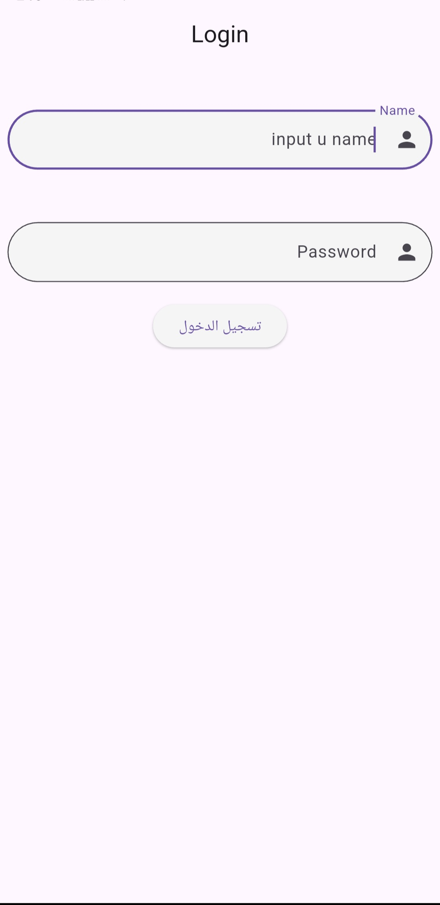
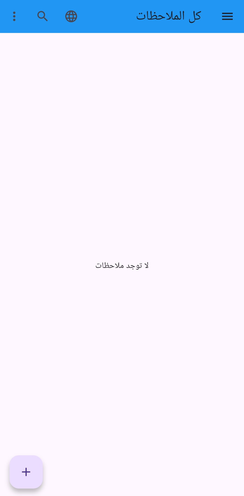
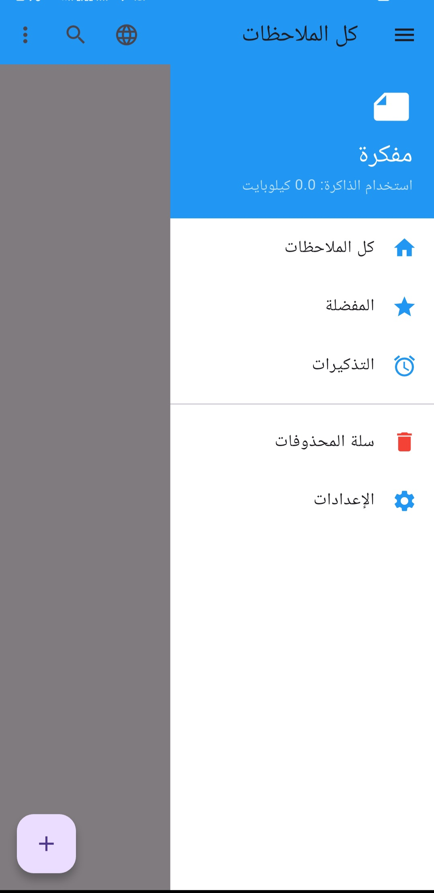
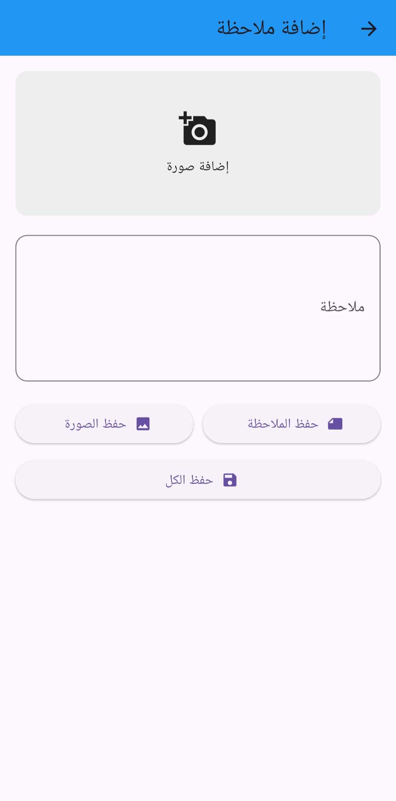

# 📝 Adler Notes App | تطبيق الملاحظات

**Adler Notes** is a modern, feature-rich Flutter application designed to help users manage their daily notes efficiently. Built with a focus on clean architecture (**MVC**) and state management using **GetX**.

**Adler Notes** هو تطبيق عصري مبني باستخدام فلاتر لمساعدة المستخدمين على إدارة ملاحظاتهم اليومية بكفاءة. تم بناؤه بالتركيز على معمارية نظيفة (**MVC**) وإدارة الحالة باستخدام **GetX**.

---

## 📸 Screenshots | لقطات الشاشة

|                Login Screen                |                 Home Page                  | Custom Drawer | Add Note (Text & Image) |
|:------------------------------------------:|:------------------------------------------:|:---:|:---:|
|  |  |  |  |

> *Please add screenshots in `screenshots/` folder named 1.png, 2.png, etc.*

---

## ✨ Features | المميزات

* **State Management:** Powered by **GetX** for high performance and reactive state management.
    * إدارة الحالة باستخدام **GetX** لأداء عالي وتفاعلية فورية.
* **Localization (i18n):** Full support for **Arabic & English** languages with RTL/LTR support.
    * دعم كامل للغتين **العربية والإنجليزية** مع ضبط اتجاه النصوص تلقائياً.
* **MVC Architecture:** Clean separation between Models, Views, and Controllers.
    * استخدام معمارية **MVC** لفصل الكود وتنظيمه.
* **Media Support:** Ability to add images from the gallery to notes.
    * إمكانية إضافة صور من المعرض إلى الملاحظات.
* **Custom UI:**
    * Custom Drawer hidden under the AppBar.
    * Animated interactions.
    * واجهة مستخدم مخصصة مع قائمة جانبية تظهر بشكل فريد تحت الهيدر.

---

## 🛠️ Tech Stack | التقنيات المستخدمة

* **Framework:** [Flutter](https://flutter.dev/)
* **Language:** Dart
* **State Management:** [GetX](https://pub.dev/packages/get)
* **Image Picker:** `image_picker`
* **Localization:** `flutter_localizations` & GetX translations
* **Icons:** `flutter_launcher_icons`

---

## 🚀 How to Run | طريقة التشغيل

1.  **Clone the repository | انسخ المستودع:**
    ```bash
    git clone [https://github.com/YOUR_USERNAME/Adler-Notes.git](https://github.com/YOUR_USERNAME/Adler-Notes.git)
    ```

2.  **Install dependencies | ثبت المكتبات:**
    ```bash
    flutter pub get
    ```

3.  **Run the app | شغل التطبيق:**
    ```bash
    flutter run
    ```

---

## 📂 Folder Structure | هيكلة المشروع

```text
lib/
├── controllers/      # Logic & State Management (GetX Controllers)
├── views/            # UI Screens (Login, Home, Add Note)
├── utils/            # Helper files (Translations)
├── main.dart         # Entry point
└── ...